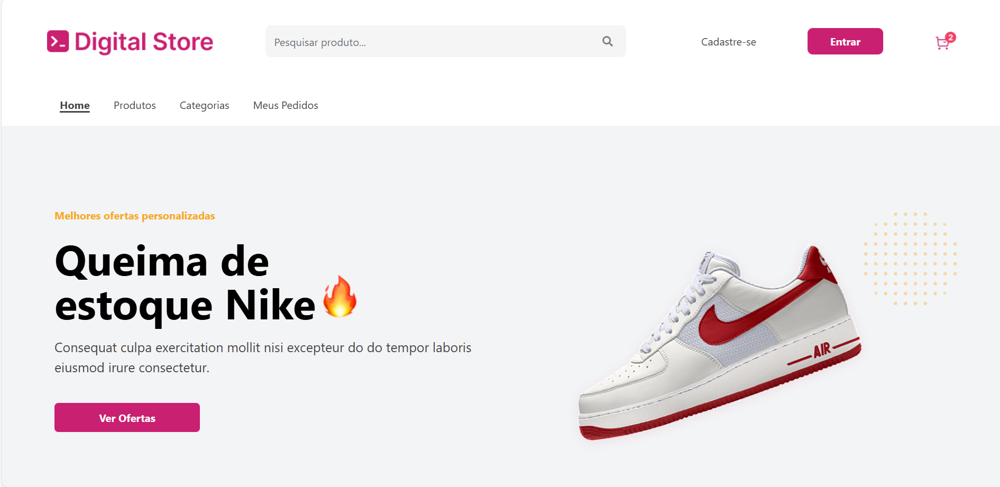
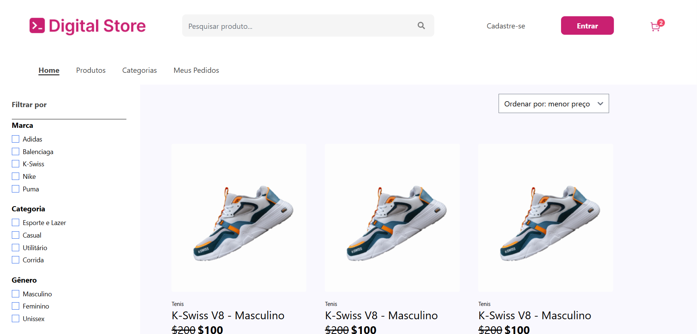
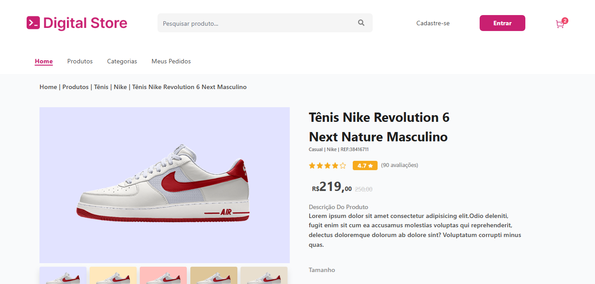

# 🚀 Projeto Final Frontend - Geração Tech 2.0 (2025)

Este projeto é resultante do programa Geração Tech 2.0 atraves dos ensinamentos de nossa professora Nayara Calenzo e nosso monitor Júlio César.
Desenvolvido como parte do curso **Presencial de Fullstack do Geração Tech 2.0 (2025)**, promovido pelo **IEL (Instituto Euvaldo Lodi)** em parceria com a **ADECE (Agência de Desenvolvimento do Estado do Ceará)** e com a **Digital Collger**.


---

## 👨‍💻 Autores:

Thais Barreto - [github](https://github.com/thaisbarreto43);
Enyd Ferreira - [github](https://github.com/enydferreira);
Luanny Lima -   [github](https://github.com/lunnart);
Antonio Jairo - [github](https://github.com/antoniofreitas0427);
---

## 🛠️ Tecnologias Utilizadas

- ⚛️ **React** - Biblioteca JavaScript para construção de interfaces de usuário.
- 🎨 **Tailwind CSS** - Framework de CSS utilitário para estilização moderna, responsiva e rápida.
- ⚡ **Vite** - Ferramenta de build extremamente rápida para desenvolvimento com React.
- ☁️ **Vercel** - Plataforma utilizada para realizar o deploy e disponibilizar o projeto online.

---

```
src/
├── assets/                     
├── Components/                   
│   ├── FiltroGrupo/              
│   ├── Footer/                   
│   ├── Header/                   
│   ├── OfertaEspecial/           
│   ├── CardColecao.jsx           
│   ├── Carrosel.jsx              
│   ├── Categorias.jsx            
│   ├── Layout.css                
│   ├── Layout.jsx                
│   ├── ProductCard.jsx           
│   ├── ProductListing.jsx        
│   └── Section.jsx               
├── pages/                        
│   ├── cardDedestaque.jsx        
│   ├── Home.jsx                  
│   ├── ProductListingPage.jsx    
│   └── ProductViewPage.jsx       
├── rotas/                        
│   └── Rotas.jsx
├── App.jsx                       
├── index.css                     
└── main.jsx    
```

## 🌐 Deploy

O projeto foi publicado na plataforma **Vercel**, que oferece deploy simples, rápido e eficiente para aplicações front-end modernas.

🔗 [Acesse o projeto online aqui](https://projeto-final-front-yax7.vercel.app)

---

## 🖼️ Layout das Páginas
/
### ✅ Página Home


### ✅ Página de Produtos


### ✅ Página de Detalhe do Produto


---

## ▶️ Como Rodar o Projeto Localmente

Siga os passos abaixo para rodar o projeto na sua máquina:

1. **Clone o repositório:**
```bash
git clone https://github.com/seu-usuario/seu-repositorio.git
